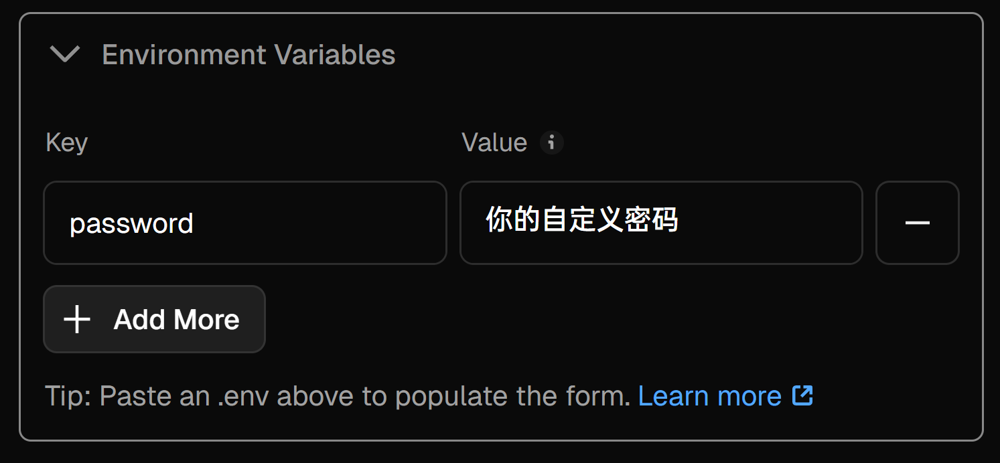

# Random API Key

一个可以随机返回 API Key 的工具，可托管于 Vercel 上。

## 能干什么

随机返回**一个** API Key，或返回**所有** API Key。可用于几个 API Key 请求 Gemini 从而达到一天内可用 Gemini 2.5 Flash 模型 250*n 次（n 为 Key 个数）。当然，如果你希望在预期使用量内使用 Gemini，请设置比预期**多**的 API Key，因为本工具无法检测单个 API Key 是否达到今日请求上限。


## 自行部署

本项目由 Flask 框架编写，可返回 **两种** 类型的 API Key：

### 前言
> [!IMPORTANT]
> 以下两种方式获取 API Key 均需要一个密码(`password`)。
>
> 均可以用 GET 和 POST 方法请求。

1. (`/api/random`) 从 `config/key` 中随机返回**一个** API Key。
2. (`/api/all`) 从 `config/key` 中以**列表(`list`)**的形式返回**所有** API Key。

> [!NOTE]
> **列表(List)**，是以类似 `['sk1', 'sk2', 'sk3', 'sk4']` 方式返回数据。可参考 [Python 列表(List) | 菜鸟教程](https://www.runoob.com/python/python-lists.html])。

### 部署方法

> [!IMPORTANT]
> 请提前在 Fork 且私密后的仓库内的 `config/key` 文件内一行一行地填入你的 Key。

1. Fork 本仓库。[Create a new fork](https://github.com/Ad-closeNN/Random-API-Key/fork)
2. 将可见性改为 **私密**。
    1. 在仓库顶端点击 **Settings**。
    2. 滑至底部，点击 **Leave fork network** 按钮并确认操作。 
    3. **等待10至30秒**，使 Fork 后的仓库脱离 Fork 网络。
    4. 刷新页面，待 **Danger Zone** 里的 **Change visibility** 按钮可用后，点击 **Change visibility** 按钮，将仓库可见性改为私密，并确认操作。 
3. 打开 [Vercel](https://vercel.com)。
4. 点击 `Add New` 按钮。
5. 选择 `Project`。
6. 在 `Import Git Repository` 中选择刚刚 Fork 好的项目。点击 `Import` 按钮。
7. 找到 `Environment Variables` 卡片，填入 `password` 和你的密码 
8. 点击 `Deploy` 按钮。
9. （可选、**建议**）在 Vercel 绑定自定义域名（中国大陆网络连接 `vercel.app` 比较困难）。
10. （可选、**不建议**）对 Vercel Anycast IP 进行优选。[LINUX DO 文章](https://linux.do/t/topic/128871)

### 如何使用

> [!TIP]
> 以下将以域名 `example.com` 为示例。`你的自定义密码` 即为上面 `Environment Variables` 中输入的密码。

#### GET 方法

- 获取单个 API Key：
  - `https://random.example.com/api/random?password=你的自定义密码`

- 获取所有 API Key：
  - `https://random.example.com/api/all?password=你的自定义密码`

#### POST 方法

- 获取**单个** API Key：
    ```python
    import requests
    payload = {"password": "你的自定义密码"}
    url="https://random.example.com/api/random"
    request = requests.post(url=url, data=payload)
    print(request.text)

    ```
    ```bash
    curl -X POST \
     -d "password=你的自定义密码" \
     https://random.example.com/api/random
    ```

- 获取**所有** API Key（列表）：
    ```python
    import requests
    payload = {"password": "你的自定义密码"}
    url="https://random.example.com/api/all"
    request = requests.post(url=url, data=payload)
    print(request.json())
    ```

    ```bash
    curl -X POST \
     -d "password=你的自定义密码" \
     https://random.example.com/api/all
    ```